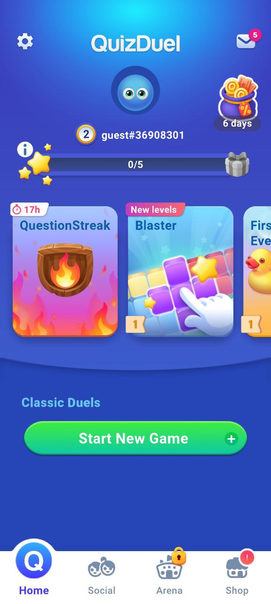

# `[HomeUI_DungNQ] – Đặc tả Giao diện Trang Home`

## 1. Mục tiêu giao diện Home

Trang Home là **trung tâm điều hướng chính** của ứng dụng Quiz Duel, cho phép:

- Hiển thị nhanh **thông tin cá nhân & thành tích người chơi**
- Truy cập nhanh vào **các chế độ thi đấu**
- Điều hướng sang các chức năng quan trọng khác như **BXH, Social, Arena, Shop**

Giao diện được thiết kế theo hướng:

- Trực quan
- Gamification (huy hiệu, streak, phần thưởng)
- Phù hợp cho người dùng mới (guest) và người dùng chính thức

---

## 2. Cấu trúc tổng thể giao diện

Giao diện Home được chia thành **5 vùng chức năng chính**:

```
+------------------------------------------------+
| (1) Header – Thông tin hệ thống                |
+------------------------------------------------+
| (2) Thông tin & thống kê người dùng             |
+------------------------------------------------+
| (3) Các chế độ / chủ đề thi đấu                 |
+------------------------------------------------+
| (4) Nút bắt đầu thi đấu                         |
+------------------------------------------------+
| (5) Thanh điều hướng dưới (Bottom Navigation)  |
+------------------------------------------------+
```

Giao diện mẫu:



---

## 3. Đặc tả chi tiết từng thành phần

---

### 3.1. Phần trên cùng – Header

**Chức năng**

- Nhận diện ứng dụng
- Truy cập nhanh các chức năng hệ thống

**Thành phần**

- **Tên App**
  - Hiển thị logo hoặc tên: _QuizDuel_

- **Phím Cài đặt (Settings Icon)**
  - Chuyển sang giao diện cài đặt

- **Phím Thông báo / Mail**
  - Hiển thị số thông báo chưa đọc
  - Điều hướng sang màn hình thông báo

**Hành vi**

- Icon thông báo có badge (số lượng)
- Phản hồi tức thì khi click

---

### 3.2. Phần giữa trên – Thông tin & thống kê người dùng

**Mục đích**

- Tạo động lực thi đấu
- Cá nhân hoá trải nghiệm người dùng

**Thông tin hiển thị**

- **Avatar người chơi**
- **Username** (ví dụ: `guest#36908301`)
- **Thống kê thi đấu**
  - Số trận thắng / tổng số trận
  - Tỉ lệ thắng (%)

- **Lĩnh vực giỏi nhất**
  - Chủ đề có tỉ lệ đúng cao nhất

- **Tiến độ / cấp độ**
  - Thanh tiến trình (level, sao, streak…)

**Đặc điểm thiết kế**

- Sử dụng icon, badge, sao
- Màu sắc nổi bật nhưng không gây nhiễu

---

### 3.3. Phần giữa – Các chủ đề / chế độ thi đấu

**Chức năng**

- Truy cập nhanh vào các mode chơi

**Nội dung**

- Các thẻ (card) chế độ:
  - Question Streak
  - Blaster
  - Event đặc biệt
  - Chủ đề theo thời gian

**Thông tin trên mỗi card**

- Tên chế độ
- Icon minh hoạ
- Thời gian còn lại (nếu là event)
- Badge “New”, “Hot”, “Limited”

**Hành vi**

- Click vào card → chuyển sang màn hình mô tả chi tiết chế độ
- Một số chế độ có thể bị khoá (theo level)

---

### 3.4. Phần giữa dưới – Nút bắt đầu game

**Nút chính (Primary CTA)**

- **Start New Game**

**Chức năng**

- Bắt đầu ghép trận nhanh
- Áp dụng luật thi đấu mặc định hoặc chủ đề đã chọn

**Hành vi**

- Điều hướng sang giao diện:
  - Chọn chế độ
  - Hoặc ghép trận trực tiếp

**Thiết kế**

- Kích thước lớn
- Màu sắc nổi bật
- Ưu tiên thu hút ánh nhìn

---

### 3.5. Phần dưới – Thanh điều hướng (Bottom Navigation)

**Chức năng**

- Điều hướng giữa các màn hình chính

**Các tab**

- **Home** (trang hiện tại)
  - Được làm nổi (highlight / raised)

- **BXH (Leaderboard)**
- **Arena**

**Hành vi**

- Chuyển trang không mất trạng thái
- Icon có badge (nếu có thông báo)

